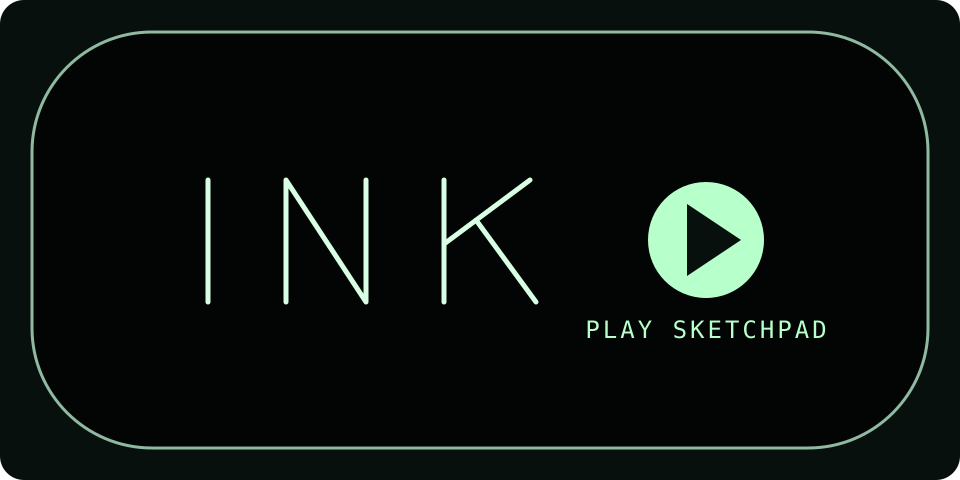

# Sketchpad

A working reconstruction of Ivan Sutherland's 1963 Sketchpad.

[Play Sketchpad](https://sketchpad.acyclic.sh/)

Build with Rust installed: `./build.sh`

This repository contains the recovered TX-2 source, reconstruction record,
simulator, and browser build. See [the reconstruction](reconstruction/) and
[runtime notes](sketchpad-web/).

The work began from `TX-2/Sketchpad@1263829` and
`TX-2/TX-2-simulator@8757845`. Thank you to the TX-2 Project contributors for
that foundation.

MIT licensed.
